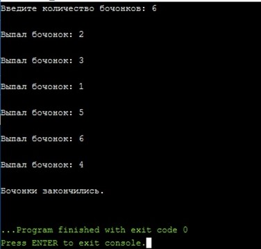

# Loto

### Описание назначения
Программа реализует проведение жеребьевки методом генерации случайных чисел. В мешке с бочонками N бочек (от 1 до N). Нажатие кнопки – вытаскивание очередного бочонка из мешка. Каждое число может выпасть только 1 раз.

### О работе с программой
Пользователь задает количество бочонков, программа генерирует слечайное число, до тех пор, пока бочонки не закончатся.

### Запуск программы
Программа реализована на языке С++, написана посредством Microsoft Visual Studio 2019. Для открытия используется файл 'Loto.txt'

### Пример работы программы

